#app
# Application Basics for DevOps

> [!summary]
> Understand how an application becomes a running service: identify its runtime, install dependencies, build and test it, package the result, then deploy and troubleshoot it. Based on the supplied KodeKloud lessons, with corrections to historical examples.

## Contents

- 
- 
- 
- 
- 
- 
- 
- 
- 
- 

## Application Lifecycle

```text
Source code in Git
  → install dependencies
  → compile or prepare application
  → run tests
  → package a versioned artifact
  → deploy with environment-specific configuration
  → verify health and monitor logs
```

A DevOps engineer needs to know what each step consumes and produces. CI automates integration checks and builds; delivery pipelines promote tested artifacts between environments. Continuous deployment also automates release to production.

| Concept | Meaning | Examples |
|---|---|---|
| Source code | Human-readable application instructions | `.java`, `.js`, `.py` |
| Runtime | Software required to execute the application | JVM, Node.js, Python |
| Dependency | Reusable code the application needs | Java libraries, Express, Flask |
| Build | Steps that prepare source for distribution | Compile, bundle, generate resources |
| Artifact | Versioned output you can deploy | JAR, WAR, wheel, container image |
| Configuration | Settings that vary by environment | Port, database address, feature flags |

Build an artifact once and promote the same version through testing and production. Record its source commit, runtime requirements, and dependency versions. Docker packages an application and runtime into an image; Kubernetes orchestrates containers.

## Source Code and Execution

### Compiled and interpreted execution

The distinction describes an execution workflow, not a strict division between languages. Runtimes may combine compilation, interpretation, and just-in-time (JIT) compilation.

| Ecosystem | Typical execution path | Deployment implication |
|---|---|---|
| C / C++ | Source → native executable | Match operating system, CPU architecture, and native libraries |
| Java | `.java` → `.class` bytecode → JVM | Match the target Java version and runtime dependencies |
| Python (CPython) | `.py` → bytecode → interpreter | Provide a compatible Python interpreter and packages |
| JavaScript on Node.js | Source → V8 execution, including JIT | Provide the required Node.js runtime and dependencies |

Java compilation produces JVM bytecode, not a native machine-code executable. CPython executes bytecode through its interpreter; it does not require a separate manual compile step. Imported Python modules may have cached bytecode under `__pycache__/`; these caches are not a complete deployment artifact.

Cross-platform source or bytecode still depends on runtime compatibility. Native extensions, operating-system APIs, and architecture-specific libraries can limit portability.

### Identify the application before building

```bash
ls -la
git status
java -version
javac -version
node --version
npm --version
python3 --version
```

Read the README and CI configuration for the supported runtime and build command. Version numbers in the lecture screenshots describe the recording, not the version to install today.

## Dependencies and Build Tools

Developers reuse modules and libraries for HTTP, filesystems, logging, authentication, and database access. Dependencies can have their own dependencies, called transitive dependencies.


| Ecosystem | Project metadata | Dependency installation or build |
|---|---|---|
| Maven | `pom.xml` | `./mvnw verify` or `mvn verify` |
| Gradle | `build.gradle` / `build.gradle.kts` | `./gradlew build` |
| Ant | `build.xml` | `ant TARGET` |
| Node.js | `package.json`, `package-lock.json` | `npm ci` |
| Python | `pyproject.toml`, often `requirements.txt` | `python -m pip install -r requirements.txt` |

Use the project's committed dependency files and tool wrappers. A manifest states dependency requirements; a lockfile records resolved versions. A requirements file is only as reproducible as the versions and transitive dependencies it pins.

## Java

### JVM, JRE, and JDK

| Component | Role |
|---|---|
| JVM | Executes Java bytecode |
| JRE | Runtime concept: JVM plus libraries and supporting files |
| JDK | Runtime plus development tools such as `javac`, `jar`, and `javadoc` |

Use a JDK to build Java applications. Deployment needs a compatible runtime; vendors may offer runtime-only packages, or projects may create custom runtime images. Java 9 changed runtime packaging and introduced modules; it did not make every vendor's JDK and JRE distribution identical.

```bash
java -version
javac -version
command -v java
command -v javac
printf '%s\n' "$JAVA_HOME"
```

`JAVA_HOME` should point to the selected JDK root, not its `bin` directory. Check that the build tool uses the intended JDK with `mvn -version` or `./gradlew --version`.

### Compile and run

Save as `MyClass.java`:

```java
public class MyClass {
    public static void main(String[] args) {
        System.out.println("Hello World");
    }
}
```

```bash
javac MyClass.java        # Produces MyClass.class
java -cp . MyClass        # Runs the class; omit the .class suffix
```

The public class name must match the source filename. The classpath tells the JVM where to find classes and libraries.

### Package a runnable JAR

```bash
jar --create --file MyApp.jar --main-class MyClass MyClass.class
jar --list --file MyApp.jar
java -jar MyApp.jar
javadoc -d doc MyClass.java
```

The `--main-class` option records the entry point in `META-INF/MANIFEST.MF`. Creating a JAR without an entry point does not make it executable with `java -jar`. See the [JAR tool reference](https://docs.oracle.com/en/java/javase/21/docs/specs/man/jar.html).

| Format | Contents and use |
|---|---|
| JAR | Classes, resources, and metadata; may be a library or executable application |
| WAR | Java web application, often deployed to a servlet container such as Tomcat |
| Fat / executable JAR | Application plus bundled dependencies or a framework-specific loader |

An ordinary JAR does not automatically bundle external libraries. Follow the project's packaging configuration to include or distribute dependencies.

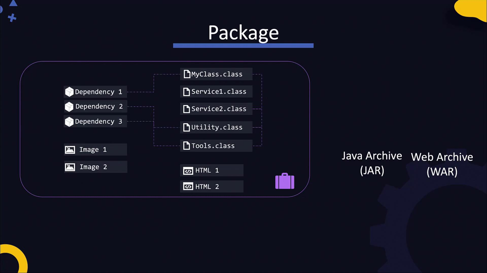

### Automate builds

| Tool | Configuration | What to recognize |
|---|---|---|
| Ant | `build.xml` | Explicit tasks and targets such as `compile`, `jar`, and `docs` |
| Maven | `pom.xml` | Standard lifecycle, dependencies, plugins, and project coordinates |
| Gradle | `build.gradle` / `build.gradle.kts` | Plugin-based tasks and a project wrapper |

Maven coordinates identify an artifact through `groupId`, `artifactId`, and `version`. A project with `<packaging>pom</packaging>` can aggregate modules and need not produce a runnable JAR itself.

```bash
# Maven: use ./mvnw instead of mvn when the repository supplies a wrapper
mvn test
mvn package
mvn verify
mvn install
mvn dependency:tree

# Gradle: wrapper selects the project's Gradle version
./gradlew tasks
./gradlew build
./gradlew run             # Requires the application plugin/task

# Ant: target names depend on build.xml
ant -projecthelp
ant compile jar
```

Maven lifecycle phases run preceding phases: `package` includes compilation and unit tests, `verify` adds configured verification checks, and `install` copies artifacts into the local Maven repository. `install` does not deploy the application to a server. Maven commonly writes artifacts to `target/`; Gradle Java builds commonly use `build/libs/`.

## Node.js and npm

### Runtime and application entry point

Node.js is a JavaScript runtime, not a framework. Express is an example of a web framework that runs on Node.js. Its non-blocking I/O model supports concurrent I/O work; CPU-heavy synchronous JavaScript can still block the event loop.

Save as `add.js`:

```javascript
const add = (a, b) => a + b;
console.log("Addition: " + add(10, 5));
```

```bash
node --version
npm --version
node add.js
```

### Project files and scripts

| File or directory | Purpose |
|---|---|
| `package.json` | Scripts, metadata, runtime requirements, and dependency ranges |
| `package-lock.json` | Resolved npm dependency tree for repeatable installation |
| `node_modules/` | Installed packages; usually excluded from Git |
| `dist/` or `build/` | Build output, if the project generates it |

Minimal `package.json` for an application whose entry file is `app.js`:

```json
{
  "name": "example-app",
  "version": "1.0.0",
  "private": true,
  "type": "commonjs",
  "scripts": {
    "start": "node app.js"
  }
}
```

`dependencies` lists runtime packages; `devDependencies` lists tools used for development, builds, or tests. Build tools may be required before producing the runtime artifact.

### Install and inspect packages

```bash
npm install express          # Adds a runtime dependency
npm install --save-dev eslint
npm uninstall express
npm ls --depth=0
npm explain express
npm run                      # Lists available scripts
npm start
```

For an existing project with a committed lockfile:

```bash
npm ci
npm test                     # If the project defines a test script
npm run build                # If the project defines a build script
```

`npm ci` requires a lockfile matching `package.json`, replaces existing `node_modules`, and does not update dependency files. Use `npm ci --omit=dev` when installing runtime dependencies after the build stage. See [npm ci documentation](https://docs.npmjs.com/cli/v11/commands/npm-ci/).

### Built-in modules and module lookup

```javascript
const fs = require('node:fs');      // Built into Node.js
const express = require('express'); // Project dependency
```

Built-in modules such as `node:fs`, `node:http`, and `node:os` require no npm installation. They are distinct from npm's own dependencies on disk. CommonJS resolves package imports through nearby `node_modules` directories and their ancestors; a global npm installation is not a reliable fallback for application imports. See [Node.js module resolution](https://nodejs.org/api/modules.html).

```bash
node -p "require.resolve('express')"
node -p "module.paths"
npm root
npm root -g
```

Use local dependencies for the application. Global installations (`npm install -g TOOL`) are mainly for command-line tools. Node.js supports both CommonJS and ES modules; check file extensions and the `type` field before mixing `require` and `import`.

## Python and pip

### Interpreter and isolated environment

Use Python 3. Python 2 reached end of support in January 2020; the lecture's 2010 date is incorrect. See [Python 2 retirement](https://www.python.org/doc/sunset-python-2/).

```bash
python3 --version
python3 -m venv .venv
source .venv/bin/activate
python --version
python -m pip --version
```

A virtual environment isolates application packages. Using `python -m pip` ties installation to that interpreter. Install the distribution's venv/pip support packages if these components are missing. See [Python virtual environments](https://docs.python.org/3/tutorial/venv.html).

Save as `main.py`:

```python
def print_message():
    print("Hello World")

if __name__ == "__main__":
    print_message()
```

```bash
python main.py
deactivate
.venv/bin/python main.py    # Activation is optional with an explicit path
```

### Manage dependencies

Run these commands inside the virtual environment:

```bash
python -m pip install flask
python -m pip install -r requirements.txt
python -m pip show flask
python -m pip list
python -m pip check
python -m pip install --upgrade flask
python -m pip uninstall flask
```

Use project-approved versions. An intentional upgrade changes the environment; test it and update the dependency files before deployment. `pip check` identifies incompatible or missing declared dependencies.

```bash
python -m pip freeze        # Prints installed versions
```

`requirements.txt` can contain pinned dependencies such as `package-name==VERSION`. Pin transitive dependencies too when repeatability matters. `pip freeze` describes the current environment; it does not decide which packages the project actually needs.

### Import paths and packaging

```bash
python -c "import sys; print(sys.executable); print(sys.path)"
python -m pip show flask
python -c "import flask; print(flask.__file__)"
```

Python searches `sys.path` when importing modules. Package locations vary with the interpreter, virtual environment, operating system, and install method. Inspect the active environment rather than assuming a fixed `/usr/lib/.../site-packages` path.

| Item | Purpose |
|---|---|
| `pyproject.toml` | Project metadata and build-system configuration |
| `requirements.txt` | Installation requirements for an environment |
| `.whl` | Built distribution installed by pip |
| Source distribution (`.tar.gz`) | Source archive that may require a build |

```bash
python -m pip install ./dist/example_app-1.0.0-py3-none-any.whl
```

The filename above is illustrative; use the artifact produced by the project. Wheels with native extensions must match supported interpreter and platform tags. Treat eggs and `easy_install` as legacy material.

## Deployment and Troubleshooting

### From build output to a service

Before deployment, identify the artifact, entry command, runtime version, working directory, configuration, listening port, and required database or external services. Keep credentials outside the source repository.

Run long-lived applications under a process supervisor or container platform. Use [linux](../Basic_knowledge/linux.md/#services-and-systemd) for systemd setup and [network](../Basic_knowledge/network.md/#troubleshooting-workflow) for connectivity checks.

### Common failures

| Symptom | First checks |
|---|---|
| `java` works but `javac` is missing | JDK installation and `PATH` |
| `UnsupportedClassVersionError` | Build bytecode target versus deployed Java runtime |
| `no main manifest attribute` | JAR manifest and correct executable artifact |
| `ClassNotFoundException` | Classpath, dependency packaging, and entry class |
| `Cannot find module` | Project directory, local dependencies, and module resolution |
| npm lockfile mismatch | Update and commit matching dependency files during development |
| Python `ModuleNotFoundError` | Active interpreter, venv, pip location, and `sys.path` |
| Native dependency fails to load | CPU architecture, OS libraries, runtime ABI |
| Works manually but fails as a service | Service user, working directory, environment, and file access |

Read the first relevant build or startup error before retrying. Distinguish a failed build from a process that starts but cannot reach its dependencies.

## Quick Reference

| Task | Java | Node.js | Python |
|---|---|---|---|
| Version | `java -version` | `node --version` | `python3 --version` |
| Project metadata | `pom.xml` / Gradle files | `package.json` | `pyproject.toml` |
| Dependencies | Build-tool configuration | `npm ci` | `python -m pip install -r requirements.txt` |
| Build | `mvn package` / `./gradlew build` | `npm run build` if defined | Project-specific; optional wheel build |
| Run | `java -jar app.jar` | `npm start` / `node app.js` | `.venv/bin/python main.py` |
| Inspect packages | `mvn dependency:tree` | `npm ls --depth=0` | `python -m pip list` |

## Original Lecture Images

All 13 images from the supplied lessons are stored under `asset/applications/`. The two diagrams used above explain dependencies and Java packaging. The remaining screenshots appear below as optional reference; rankings, version lists, and installation screens are historical.

> [!example]- Language overview and execution model
> 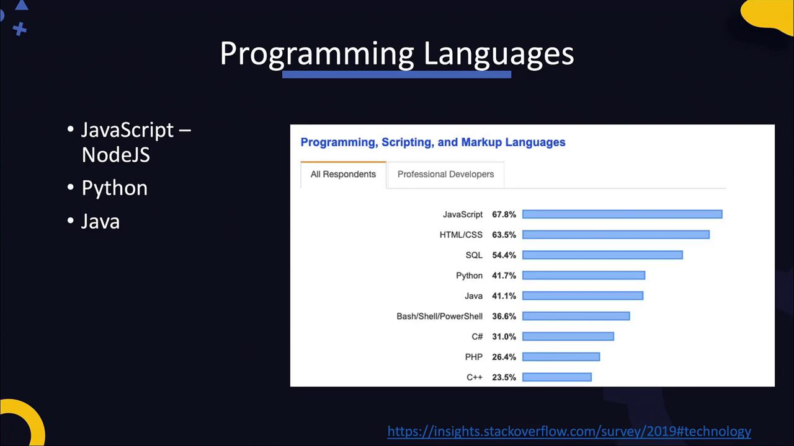
> 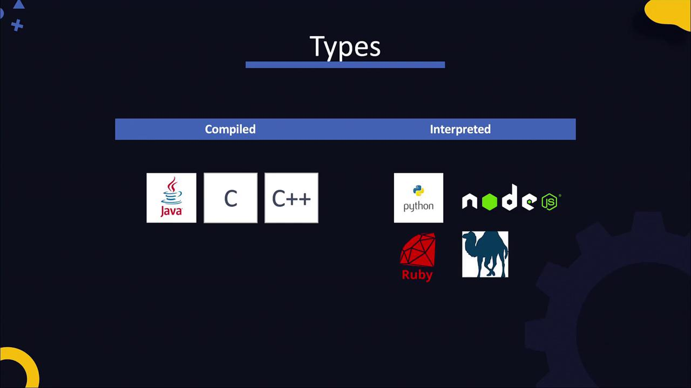
>
> The compiled/interpreted split is simplified. Use the execution table above for Java bytecode, CPython, and Node.js details.

> [!example]- Java overview and runtime packaging
> 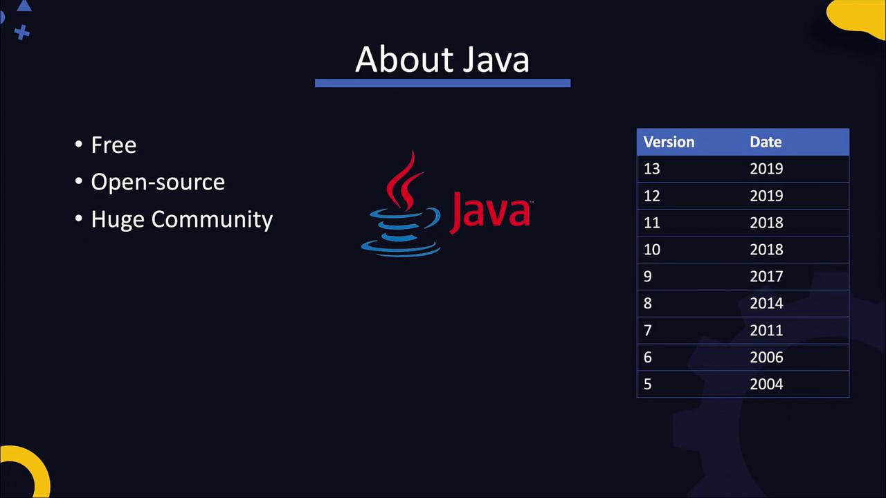
> 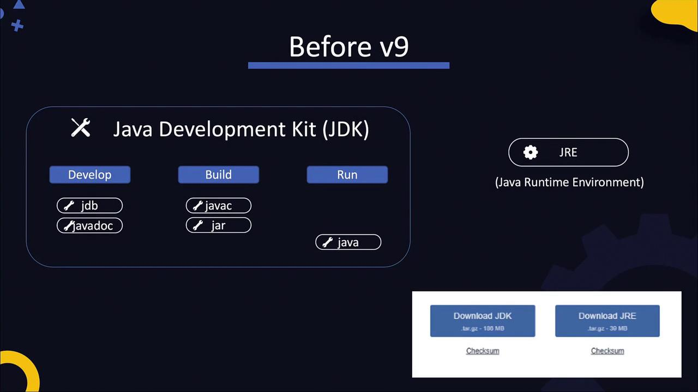
> 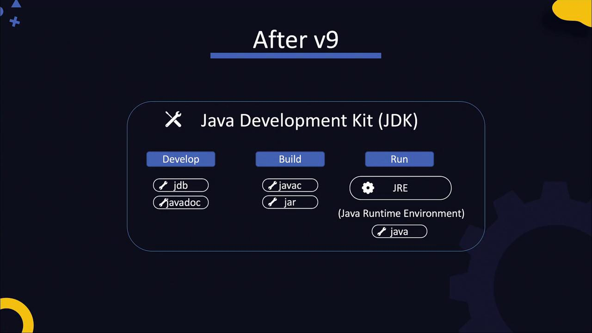
> 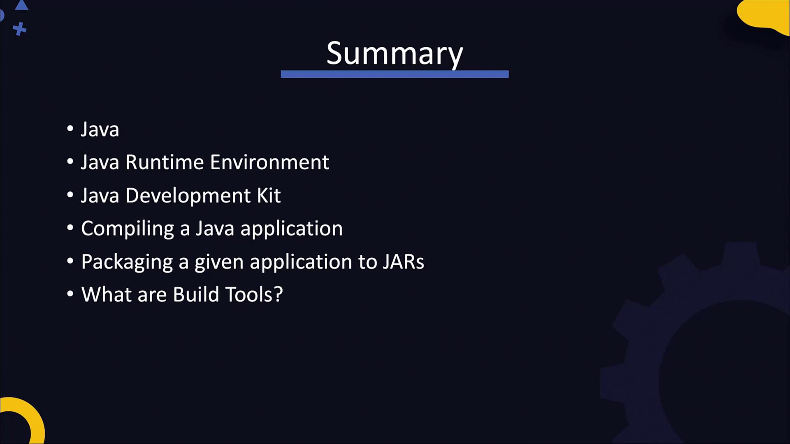
>
> Runtime-only distribution options depend on the Java vendor and version.

> [!example]- Node.js and early web applications
> 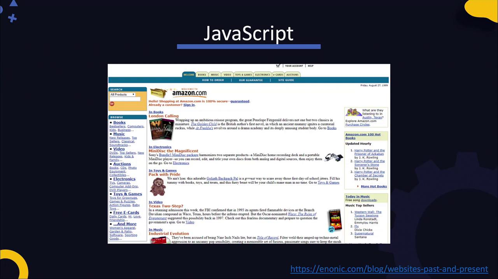
> 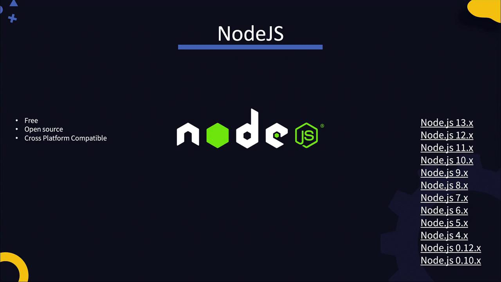
> 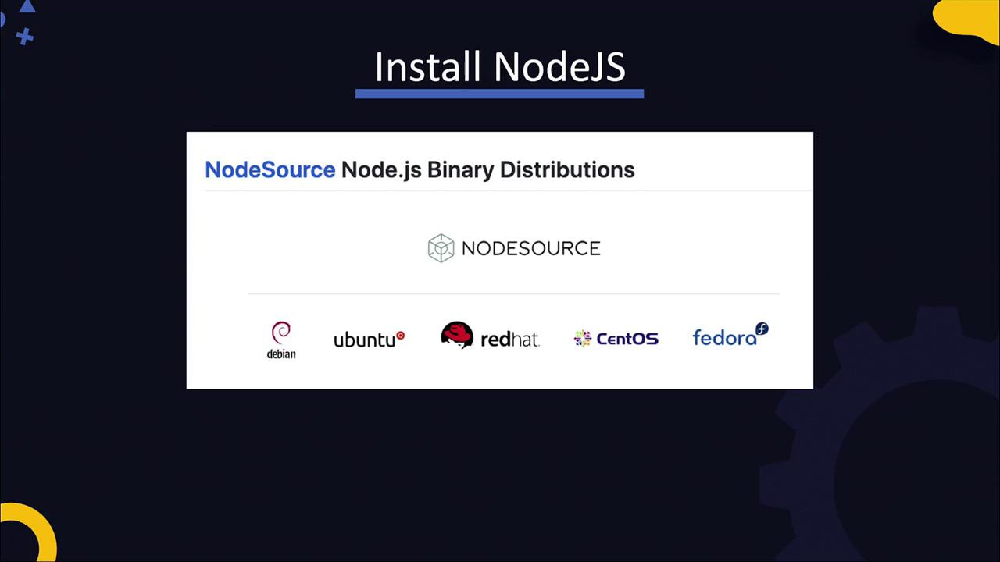

> [!example]- Python overview and historical download page
> 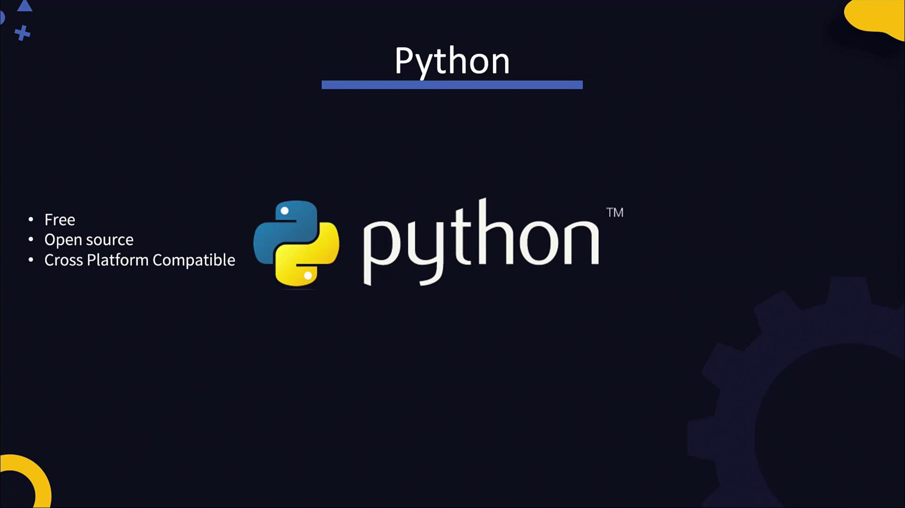
> 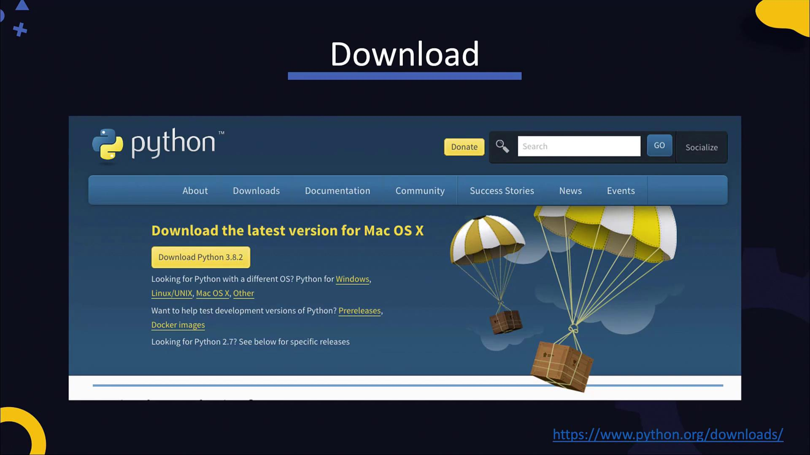

## Sources

- KodeKloud lessons supplied in this conversation: Introduction, Java Introduction, Java Build Packaging, NodeJS Introduction, Node JS NPM, Python Introduction, and Python PIP.
- [KodeKloud documentation index](https://notes.kodekloud.com/llms.txt)
- [DevOps Pre-Requisite course index](https://notes.kodekloud.com/_llms/beta/courses/dev-ops-pre-requisite-course.md)
- Original images: KodeKloud, downloaded from the lesson image URLs. They retain their original content and attribution.

Related notes: [linux](../Basic_knowledge/linux.md/), [network](../Basic_knowledge/network.md/), [server_nas_command](../Basic_knowledge/server_nas_command.md/).
