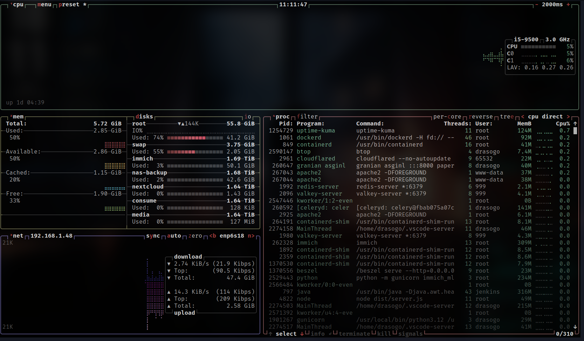
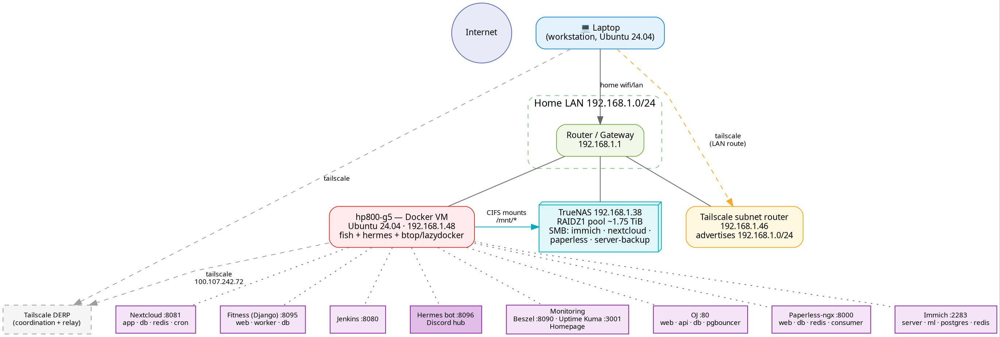
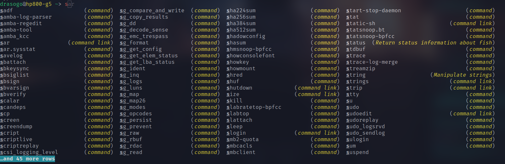
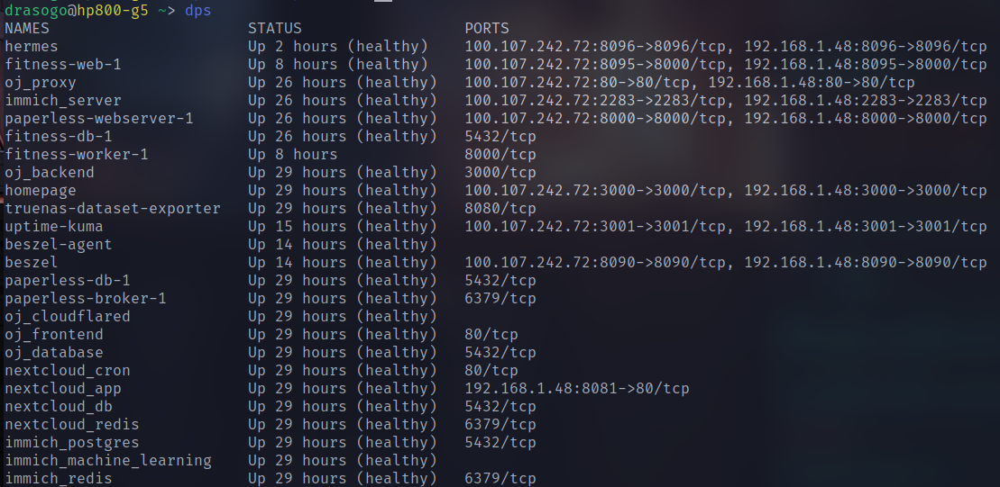
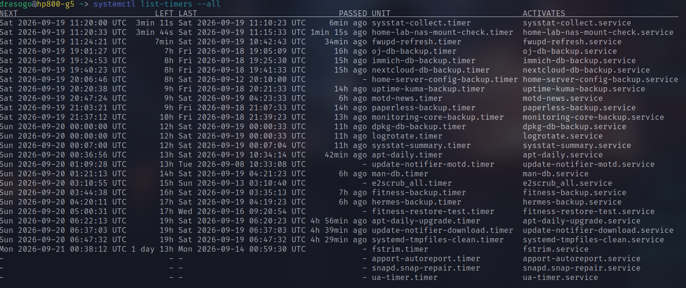
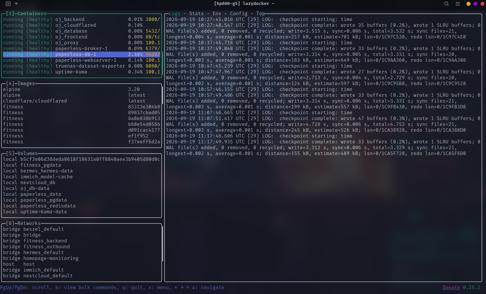
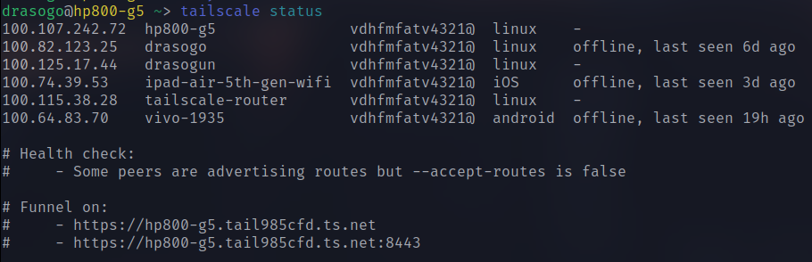
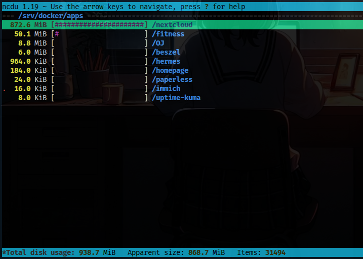
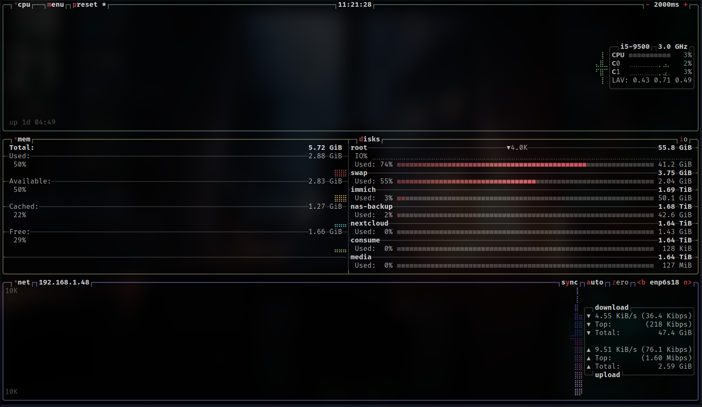

*Tags: `#network` `#docker` `#server` `#devops` `#linux`*

# What
Command reference for running the home server farm — Ubuntu Docker VM (`192.168.1.48`), Proxmox (`192.168.1.47`), TrueNAS (`192.168.1.38`), Tailscale router (`192.168.1.46`) — the shell on the VM is fish (ghost text + `Ctrl+R` fuzzy history search). See [linux](../Basic_knowledge/linux.md/) for general commands.


> btop default layout — CPU/MEM/NET/PROC boxes all in one screen


> Topology of the whole farm

!!! info "Aliases on the VM (`~/.config/fish/config.fish`)"
    `cat` → batcat · `top` → btop · `df` → duf · `dc` → docker compose · `dps` → docker ps table · `apps` → cd /srv/docker/apps · `hstat` → check Hermes health · `hb` → run Hermes backup


> fish on the real machine — the gray ghost text is the suggestion, press `→` to accept, `Tab` for the dropdown completion

# Daily Health Check
The daily check routine after ssh-ing into the VM — top to bottom in under 2 minutes tells you whether the box is healthy.

## df -h
```bash
df -h /
```
Root disk usage — this VM's root is only 56G and already ~75% used. If it fills up, every container on the box goes down at once. (On the VM just typing `df` works too — it's aliased to duf, which is prettier and includes all 5 NAS mounts in one table.)

## free -h
```bash
free -h
```
RAM — look at the `available` column, not `free`: Linux uses spare RAM for disk cache and always gives it back to processes when needed.

## uptime
```bash
uptime
```
Load average over 1/5/15 minutes — on this 2-core box, sustained numbers above 2 mean it's working hard.

## dps
```bash
dps
```
(alias for `docker ps --format ...`) A table of all 26 containers with status + ports in one screen — every row should read `Up ... (healthy)`.


> Real `dps` output — look for the word `healthy` in the STATUS column

## docker compose ps
```bash
docker compose ps
```
Like `dps` but only the project you're standing in (run from the project directory, e.g. `cd /srv/docker/apps/OJ`) — for drilling into one app when that app has a problem.

## systemctl list-timers
```bash
systemctl list-timers --all | grep backup
```
The full backup timer table — LAST / NEXT columns show when each backup last ran and fires next. If LAST skips days, one of them is dead.


> `systemctl list-timers --all` — the bottom half of the table is the whole backup schedule of this machine

## hstat
```bash
curl -s http://192.168.1.48:8096/healthz | jq .
```
(alias `hstat`) Hermes bot health — expect `"status": "ok"` and `"discord": true`. If discord is false, the gateway dropped.

## mount
```bash
mount | grep cifs
```
Active NAS mounts — there should be 5: immich, nextcloud, paperless media, paperless consume, server-backup. If one is missing, that app's backup fails immediately.

# Docker
Managing 26 containers across 10 compose projects under `/srv/docker/apps/` — `docker compose ...` commands run from inside a project directory (`apps` then `cd OJ` etc).

## docker compose up
```bash
docker compose up -d --build
```
The main deploy command — rebuild images and recreate changed containers. Run this after every `git pull`.

```bash
docker compose up -d
```
Start containers without rebuilding — for when you're just restarting, no code changes.

## docker compose logs
```bash
docker compose logs -f --tail=100 backend
```
Follow the `backend` service logs live (`-f`) starting from the last 100 lines — drop the service name for every service in the project; drop `-f` for a one-shot read.

## docker compose exec
```bash
docker compose exec database sh
```
Open a shell inside a running container.

```bash
docker compose exec -T database pg_dump -U postgres ojdb | gzip > backup.sql.gz
```
`-T` disables TTY so the piped output stays clean — this is the core of every backup script on this box.

## docker compose down
```bash
docker compose down
```
Stop + remove containers but **keep named volumes** (database data survives).

!!! danger "Never append `-v` by accident — `down -v` deletes volumes including the entire PostgreSQL data. Run `docker volume ls` and take a backup first."

## docker inspect
```bash
docker inspect oj_backend --format '{{.State.Health.Status}}'
```
Pull a single value, scriptable — commonly used fields: `.State.Status`, `.Config.Image`, `.NetworkSettings.IPAddress`.

## docker logs
```bash
docker logs --tail 100 oj_backend
```
Read logs by container name (not service) — works from anywhere, no need to cd into the project.

## docker system df
```bash
docker system df
```
How much disk Docker eats: images / containers / volumes / build cache — run before pruning to know how many GB you'll get back.

## lazydocker
```bash
lazydocker
```
Docker TUI in a single screen — containers/images/volumes on the left, logs/stats/config of the selection on the right. No more typing long container names.


> lazydocker with the container list on the left + logs on the right

| Key | Action |
|---|---|
| `1`–`6` | Switch panels: projects, services, containers, images, volumes, networks |
| `[` `]` | Previous / next tab of the right panel |
| `m` | View logs of the selection |
| `r` / `s` | restart / stop container |
| `E` | Open a shell inside the container |
| `d` | Remove container/image/volume |
| `b` | Bulk commands (e.g. prune all images at once) |
| `/` | Filter the list |
| `esc` | Go back |

# Network
Checking network paths, firewall, and access from the outside.

## ip route get
```bash
ip route get 192.168.1.47
```
Which interface and gateway a packet to that host actually takes — the fastest answer to "where is my traffic going right now? Through Tailscale or not?"

## ss
```bash
sudo ss -lntp
```
Every listening TCP port + process names — for "what is eating port 8080".

## ping
```bash
ping -c 5 1.1.1.1
```
Internet without DNS — pair with `ping -c 5 example.com`: if the IP works but the name fails, it's a DNS problem, not connectivity.

## curl
```bash
curl -I http://127.0.0.1
```
Headers only, from the machine itself — bypasses DNS and proxy: if this answers but the real site doesn't, the problem is upstream of the app.

```bash
curl -4 ifconfig.me
```
The machine's public IPv4 — confirms which way traffic exits.

## nmap
```bash
nmap -sn 192.168.1.0/24
```
Discover every host on the LAN — `-sn` is a ping scan only, no port probing.

## ufw
```bash
sudo ufw status verbose
```
Full firewall state: default policies + rules + per-interface bindings — check this before blaming an app for being unreachable.

```bash
sudo ufw allow in on tailscale0 to any port 22 proto tcp
```
Allow SSH only on the Tailscale interface — another common form: `allow from 192.168.1.0/24 to any port 22 proto tcp`.

### tailscale
Mesh VPN reaching LAN `192.168.1.0/24` from outside via the router node `192.168.1.46`.

```bash
tailscale status
```
Every machine in the tailnet with IP + last seen + who advertises the LAN route.


> `tailscale status` — the line with `offer`/`advertises routes` is the subnet router (192.168.1.46)

```bash
tailscale ping hp800-g5
```
Path test — `via 1.2.3.4:port` = direct connection, `via DERP` = relayed through Tailscale's servers (slower).

```bash
tailscale netcheck
```
NAT/relay diagnostics: UDP or not, nearest DERP, latency.

```bash
sudo tailscale set --accept-routes=true
```
(On a remote client) Accept the advertised `192.168.1.0/24` route — if the LAN acts weird after coming home, flip back to `false`.

```bash
sudo tailscale set --advertise-routes=192.168.1.0/24
```
(On the router) Advertise the subnet into the tailnet — must be approved in the Tailscale admin console first.

```bash
sudo tailscale funnel --bg 80
```
Expose local port 80 to the real internet through Tailscale — check with `tailscale funnel status`, stop everything with `sudo tailscale funnel reset`.

# Systemd & Logs
Everything scheduled on this box (backup timers, mount checks) is systemd timers.

## systemctl --failed
```bash
systemctl --failed
```
All failed units in one list — the first thing to look at when the box "acts weird" after a reboot.

## systemctl status
```bash
systemctl status oj-db-backup.service
```
Any unit's state + recent log lines + PID — works on timers too (`status oj-db-backup.timer`).

## journalctl
```bash
journalctl -u hermes -n 100 --no-pager
```
The last 100 lines of a unit.

```bash
journalctl -u hermes --since "1 hour ago" -f
```
Since an hour ago, then keep following — `--since today` works too.

```bash
journalctl --disk-usage
```
How much disk the logs consume — if it swells past 1-2 GB: `sudo journalctl --vacuum-size=500M`.

## systemctl cat
```bash
systemctl cat oj-db-backup.timer
```
The unit file exactly as systemd loaded it, including overrides — answers "what does this timer actually run".

## systemctl enable
```bash
sudo systemctl enable --now hermes-backup.timer
```
Enable at boot + start immediately — the one-liner when installing a new timer/service.

```bash
sudo systemctl daemon-reload
```
**Required** after editing any unit file — without it systemd keeps running the old definition.

# Disk & Files
Finding where the disk went, copying, verifying backups.

## ncdu
```bash
ncdu -x /
```
Interactive "where did my disk go" — walk directory by directory. `-x` stays on one filesystem so it never wanders into the slow CIFS mounts. Press `d` to delete (it always asks first).


> ncdu sorts directories by size, largest first — just walk down to find the culprit

## du
```bash
du -sh /var/lib/docker/volumes/
```
Total size of Docker named volumes — check before pruning anything.

## rsync
```bash
rsync -aH --info=progress2 SRC/ DST/
```
Archive copy (`-a` keeps permissions/times) + hardlinks (`-H`) + a progress bar.

```bash
rsync -aH --delete --dry-run SRC/ DST/
```
**Preview first** what `--delete` would remove — `--delete` makes the destination a mirror of the source (files missing from src get deleted). Never skip the dry-run.

## gzip
```bash
gzip -t backup.sql.gz
```
Verify the archive isn't corrupt — no output means the gzip structure is fine (it says nothing about the SQL inside; only a real restore proves that).

## tar
```bash
tar -tzf backup.tar.gz
```
List archive contents without extracting — checks that a backup isn't empty or truncated.

## find
```bash
find /srv/docker/apps -name "*.yaml" -mtime -7
```
Which configs were modified in the last week — for investigating "what did I change yesterday".

## grep
```bash
grep -rn "PATTERN" /srv/docker/apps/OJ/
```
Recursive search with file:line — add `-i` for case-insensitive.

# Database (PostgreSQL)
Service name is `database`, container is `oj_database` — run from the OJ project directory.

## psql
```bash
docker compose exec database psql -U postgres -l
```
List all databases — confirm the target name before doing anything destructive.

```bash
docker compose exec database psql -U postgres ojdb -c "SELECT COUNT(*) FROM users;"
```
One-shot SQL — a sanity check on data after a restore.

## pg_dump
```bash
docker compose exec database pg_dump -U postgres -Fc ojdb > dump.pg
```
Custom-format dump (`-Fc`) — self-compressing + supports selective restore with pg_restore.

## pg_restore
```bash
docker compose exec database pg_restore -U postgres -d ojdb --clean dump.pg
```
Restore a custom dump — `--clean` drops existing objects before re-creating them.

## restore (plain gzip)
```bash
gzip -dc oj-backup.sql.gz | docker compose exec -T database psql -U postgres ojdb
```
Restore a compressed plain-text dump — **fully overwrites the target**. Always confirm the database name and keep a fresh dump first.

# Proxmox
Hypervisor at `192.168.1.47:8006` — ssh as `root@192.168.1.47`, commands run on the host.

## qm list
```bash
qm list
```
All VMs with status — the Docker VM is the one doing the real work.

## qm shutdown
```bash
qm shutdown 100
```
Clean shutdown through the guest OS — always prefer this one.

```bash
qm stop 100
```
Pulling the power cord — only when the guest can't respond anymore.

## pct
```bash
pct list
```
All LXC containers — `pct enter 101` opens a shell inside one.

## pvesh
```bash
pvesh get /cluster/resources
```
Raw API view: every node/VM/CT with cpu+mem — scriptable, no web UI needed.

# Monitoring (TUI)
Full-screen tools for watching status in real time.

## btop
```bash
btop
```
Everything in one screen: CPU per core, RAM, disk I/O, network graph, process list — always the first thing to open when "the server feels slow" (typing `top` works too, it's aliased).


> Press `4` to expand the PROC box to full screen — select a process then `t`/`k` to terminate/kill

| Key | Action |
|---|---|
| `1` `2` `3` `4` | Toggle CPU / MEM / NET / PROC boxes |
| `↑` `↓` | Select process · `enter` for details |
| `t` | Terminate the selection (SIGTERM) |
| `k` | Kill the selection (SIGKILL) |
| `s` | Send any signal |
| `space` | Expand/collapse the process tree |
| `/` | Filter processes |
| `m` / `f2` / `f1` | menu / options / help |
| `q` | Quit |

# Hermes
Discord command center + notification hub on the VM (`:8096`) — every backup script reports through `hermes-notify`.

## hermes-notify
```bash
hermes-notify --source test --status failure --detail "wiring check"
```
Smoke-test the alert path — a 🚨 should appear in the audit channel immediately.

## backup-hermes
```bash
sudo /usr/local/sbin/backup-hermes.sh
```
(alias `hb`) Run the Hermes backup by hand — output lands in `/mnt/nas-backup/Hermes/`.

# High-Risk Commands

!!! danger "Verify the target, current state, and a usable backup before running anything in this table."

| Command | Risk | Safer check |
|---|---|---|
| `docker compose down -v` | Deletes volumes including databases | `docker volume ls` + backup first |
| `gzip -dc ... \| psql` | Overwrites the target database | `psql -l` to confirm the name + fresh dump first |
| `node dist/scripts/init_db.js` | May drop/recreate tables | Read the script first |
| `rsync --delete` | Removes destination-only files | `--dry-run` first |
| `rm -rf PATH` | Permanent | `pwd` + `ls -ld PATH` |
| `qm stop VMID` | Power-cuts the VM | `qm shutdown` first |

```text
Inspect → understand → change one thing → verify
```

# Related Topics
- [linux](../Basic_knowledge/linux.md/) — general Linux commands
- Docker — Docker fundamentals
